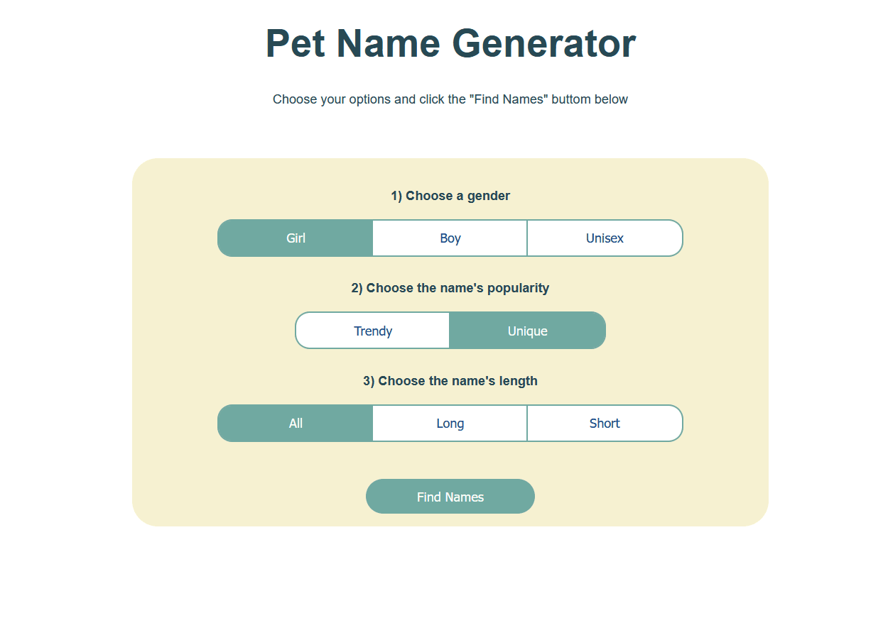

<h1 align="center"> A web app to generate your pet name</h1>
<br>




<p align="center">
  <a href="#key-features">Key Features</a> •
  <a href="#how-to-use">How To Use</a> 
</p>

## Key Features

You can select: 
- A gender
- Name's popularity
- Name's length

### How To Use

To clone and run this application, you'll need [Git](https://git-scm.com) and [Node.js](https://nodejs.org/en/download/) (which comes with [npm](http://npmjs.com)) installed on your computer. From your command line:

```bash
# Clone this repository
$ git clone https://github.com/maridoroshuk/github-user-info
# Go into the repository
$ cd github-user-info
# Install dependencies
$ npm install
# Run the app
$ npm start
```

Note: If you're using Linux Bash for Windows, [see this guide](https://www.howtogeek.com/261575/how-to-run-graphical-linux-desktop-applications-from-windows-10s-bash-shell/) or use `node` from the command prompt.
